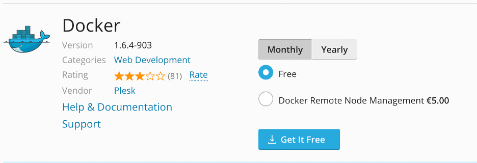

# How to Host Go App on Plesk

In the modern landscape of web development, deploying applications is a crucial aspect of bringing your software to life. The Go programming language, a statically typed and compiled language known for its efficiency and performance, has gained immense popularity among developers. Leveraging the power of Go, you can build robust and high-performance web applications.

However, deploying Go applications can be a complex task, requiring a solid grasp of server configurations, environment settings, and other technical nuances. This is where Plesk control panel comes into play as a game-changer. Plesk, a powerful web hosting control panel, provides an intuitive and user-friendly interface for managing various aspects of web hosting and server administration.

In this article, we'll take you through the process of running Go applications with Plesk, step by step. We'll show you how to harness the benefits of both Go's speed and Plesk control panel's ease of use, making it easier than ever to host and manage your web applications.

You'll learn how to prepare your Go application for deployment, set up Plesk, configure your server environment, and deploy your application successfully. By the end of this guide, you'll have a clear understanding of how to utilize Plesk to streamline the deployment of your Go applications, reducing the technical complexities that often come with hosting web applications. Whether you're a beginner or an experienced developer, this article will equip you with the knowledge and tools to efficiently run Go applications on your server.

## Section 1: Prerequisites

Before diving into the process of running Go applications with Plesk, it's essential to ensure you have the necessary prerequisites in place. Here's a detailed breakdown of what you need:

### Plesk Installation

To use Plesk, you must install it on your server. Ensure you have the latest version installed, or the version you intend to use. If you haven't already installed Plesk, you may need to follow the official installation guide for your specific server and operating system. There is no need to worry about the license, you can get a two-week trial license right from the panel.

### Server or Hosting Environment

You should have access to a server or hosting environment where Plesk is installed. This environment will be the foundation for hosting your Go application.
Also, you need to know that Docker is available only for Plesk administrators.

### Go Knowledge

While this guide will walk you through the technical aspects of deploying Go applications, having a basic understanding of the Go programming language is beneficial. You should be familiar with concepts like package management, building, and running Go applications.
With these prerequisites in place, you'll be well-prepared to follow the steps in this guide for running your Go application with Plesk. It's essential to ensure you have a reliable hosting environment (Plesk), as well as a basic understanding of Go, to make the process smoother and more efficient.

## Section 2: Preparing Your Go Application

Before you can deploy a Go application with Plesk, you'll need to prepare your application for hosting. For demonstration purposes, let's create a simple HTTP application. Here are the steps to follow:
- Create a directory for the project:

```bash
mkdir go-http-sample
cd go-http-sample
```

- Create the main.go file in the go-http-sample directory:

```go
package main

import (
    "fmt"
    "net/http"
)

func hello(w http.ResponseWriter, req *http.Request) {
    fmt.Fprintf(w, "hello\n")
}

func main() {
    http.HandleFunc("/", hello)
    http.ListenAndServe(":8090", nil)
}
```

- Test your application locally:

```
#> go run main.go &
#> curl localhost:8090/
hello
```

- Then let’s create a sample Dockerfile:

```docker
FROM golang:1.20.10-alpine3.18 as builder

WORKDIR /app
COPY go.mod go.sum ./
RUN go mod download
COPY . .
RUN CGO_ENABLED=0 GOOS=linux go build -o ./http-server


FROM scratch

WORKDIR /app

COPY --from=builder /app/http-server .
EXPOSE 8090

CMD ["/app/http-server"]
```

- Test your docker image:

```
#> docker run -itd -p 8090:8090 $(docker build -q .)
dae1ae701a2f876978874e995420080cd86f66c95bc6b2f0db39bed2e849e2d7 
#> curl localhost:8090/
hello
```

Cool, everything is working as expected and now we can prepare the Plesk control panel 

## Section 3: Setting Up Plesk 

I’m assuming you already have a Plesk instance. Then, you need to install a docker extension. You can do it easily via the extension catalog.   



Plesk has a useful feature - you can create a domain with a temporary domain name for the test purpose, so let’s create a new domain.
 


Nice, now we have a test domain, and we can deploy our test service.


 
## Section 4: Deploying Your Go Application

First of all, we need an image that we have to run on our server. You can do it by the command (I’m using MacOS) 

```
#> docker buildx build --platform=linux/amd64 -t go-http-sample:latest .
#>  docker save go-http-sample:latest | gzip > go-sample.tar.gz
```

Next, open the docker extension and upload the created image, then run it.
Also, you can push the image to the official Docker Hub (https://hub.docker.com/)


 
In the settings, turn off auto port mapping. 

Next, open the Docker Proxy Rules


 
And add the rule 


 
## Section 5: Testing Your Application

Now you can open a browser and follow the link https://reverent-ganguly.139-59-209-22.plesk.page/


  
### Section 6: Conclusion

As you can see, you can simply deploy any Go application. Also, using Plesk control panel you can easily add an SSL certificate, maintain security fixes, monitor your application, and do many other important actions. 
Using the Docker extension, you can fully manage your application, update or restart it, view logs, etc.
